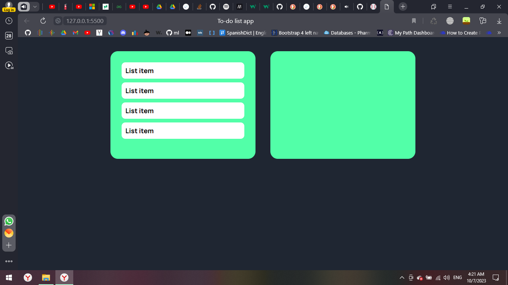

# To-do list app

## Table of contents

- [Overview](#overview)
  - [The challenge](#the-challenge)
  - [Screenshot](#screenshot)
  - [Links](#links)
- [My process](#my-process)
  - [Built with](#built-with)
  - [What I learned](#what-i-learned)
  - [Continued development](#continued-development)
  - [Useful resources](#useful-resources)
- [Author](#author)
- [Acknowledgments](#acknowledgments)

## Overview

Users should be able to: drag and drop

### The challenge

To learn and absorb new js concepts

### Screenshot

### Links

- Solution URL:
- Live Site URL:

## My process

### Built with

- Semantic HTML5 markup
- CSS custom properties
- JS

<!-- ### What I learned

This is a snippet of the things I learnt today building this To-do app:
To see how you can add code snippets, see below:

- Gives the perfect alignment between the input box and btn -->

### Continued development

As for future development, I would like to add cute animations, and make it more aesthatic
**Note: Delete this note and the content within this section and replace with your own plans for continued development.**

### Useful resources

- [Flex box cheat sheet](https://css-tricks.com/snippets/css/a-guide-to-flexbox/) this helps me to visually get what I need to know regarding flex

## Author

Amira K.

<!-- - Website - [Add your name here](https://www.your-site.com)
- Frontend Mentor - [@yourusername](https://www.frontendmentor.io/profile/yourusername)
- Twitter - [@yourusername](https://www.twitter.com/yourusername)
 -->
