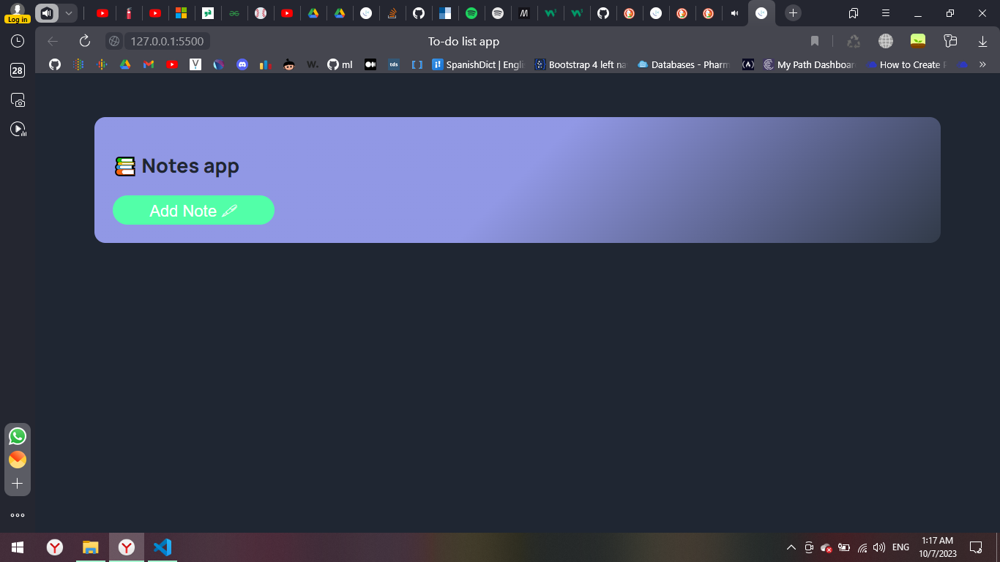
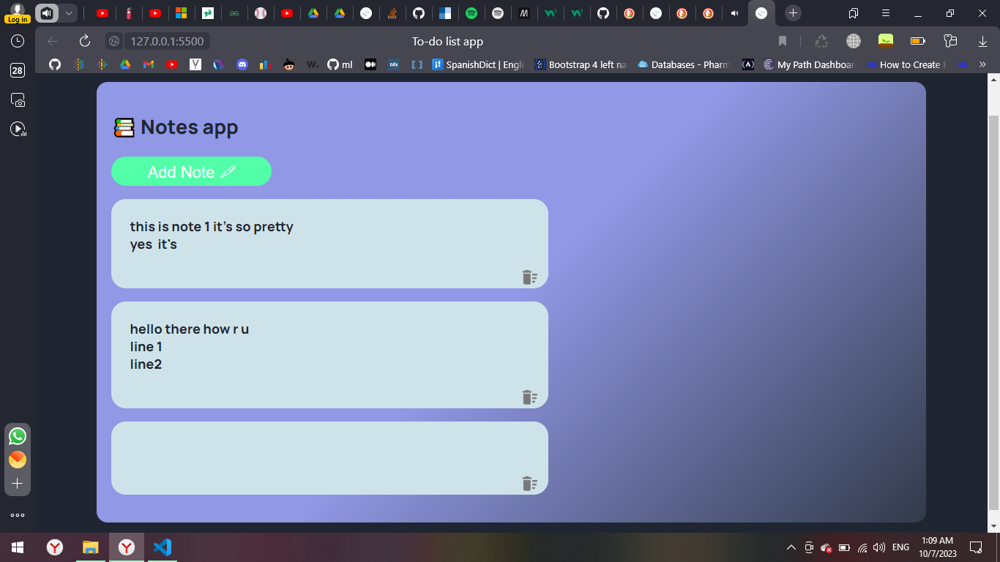

# To-do list app

## Table of contents

- [Overview](#overview)
  - [The challenge](#the-challenge)
  - [Screenshot](#screenshot)
  - [Links](#links)
- [My process](#my-process)
  - [Built with](#built-with)
  - [What I learned](#what-i-learned)
  - [Continued development](#continued-development)
  - [Useful resources](#useful-resources)
- [Author](#author)
- [Acknowledgments](#acknowledgments)

## Overview

Users should be able to:

- Add his/her notes to the list by clicking on the add btn, also user should be able to delete unwanted notes.

### The challenge

To learn and absorb new js concepts

### Screenshot





### Links

- Solution URL:
- Live Site URL:

## My process

### Built with

- Semantic HTML5 markup
- CSS custom properties
- JS

### What I learned

- This is a snippet of the things I learnt today building this To-do app:
- To see how you can add code snippets, see below:

- This code snippet adds an event listener to the document object for the "keydown" event. This means that whenever a key is pressed while the document is in focus, the specified callback function will be executed.

- Inside the callback function, it checks if the key that was pressed is the "Enter" key. The condition event.key === "Enter" compares the value of the event.key property to the string "Enter". If the condition is true, it means that the "Enter" key was pressed.

- When the "Enter" key is detected, the code executes the document.execCommand("insertLineBreak") method. This method inserts a line break at the current cursor position. Essentially, it simulates pressing the "Enter" key to create a new line.

- Additionally, the event.preventDefault() method is called. This method prevents the default behavior of the "Enter" key, which is typically to create a new line or submit a form. By calling event.preventDefault(), the code ensures that only a line break is inserted without triggering any other default actions associated with the "Enter" key.
- If this code isn't writen when the page is refreshed the lines written after the enter will be outside the note box.

```js
document.addEventListener("keydown", (event) => {
  if (event.key === "Enter") {
    document.execCommand("insertLineBreak");
    event.preventDefault();
  }
});
```

### Continued development

As for future development, I would like to add cute animations, and make it more aesthatic
**Note: Delete this note and the content within this section and replace with your own plans for continued development.**

<!-- ### Useful resources

- [Example resource 1](https://www.example.com) - This helped me for XYZ reason. I really liked this pattern and will use it going forward.
- [Example resource 2](https://www.example.com) - This is an amazing article which helped me finally understand XYZ. I'd recommend it to anyone still learning this concept.
 -->

## Author

Amira K.

<!-- - Website - [Add your name here](https://www.your-site.com)
- Frontend Mentor - [@yourusername](https://www.frontendmentor.io/profile/yourusername)
- Twitter - [@yourusername](https://www.twitter.com/yourusername)
 -->
