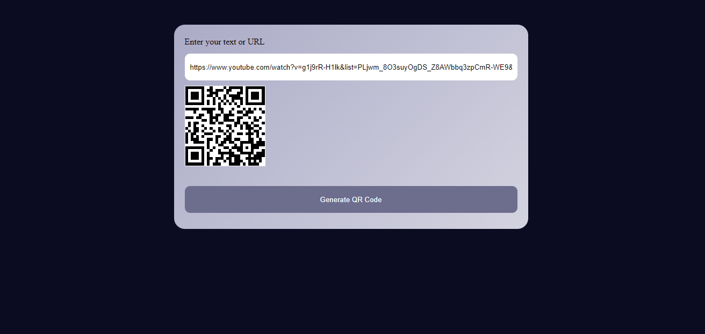

In this repo I'm recording my learning curve to learn js, while building simple projects till eventually mastering this✨🎃
 
Projects done:  
📌Simple Weather App (API) 
📌Advice generator app (API) 
📌To-do list 
📌Note app 
📌Qr generator App 
Images:  

- Simple weather app
  
- Advice generator app
  
- Todo list
  
- Notes app
  
- Qr generator app
  
