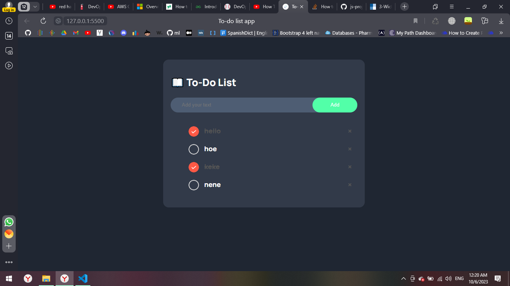

# To-do list app

## Table of contents

- [Overview](#overview)
  - [The challenge](#the-challenge)
  - [Screenshot](#screenshot)
  - [Links](#links)
- [My process](#my-process)
  - [Built with](#built-with)
  - [What I learned](#what-i-learned)
  - [Continued development](#continued-development)
  - [Useful resources](#useful-resources)
- [Author](#author)
- [Acknowledgments](#acknowledgments)

## Overview

Users should be able to:

- Add his/her todo list by clicking on the add btn or by pressing enter when finished typing, no empty list is allowed, by clicking on the circle or the item, this item would be checked, and by pressing on the (x) the item would be removed.

### The challenge

To learn and absorb new js concepts

### Screenshot



### Links

- Solution URL:
- Live Site URL:

## My process

### Built with

- Semantic HTML5 markup
- CSS custom properties
- JS

### What I learned

This is a snippet of the things I learnt today building this To-do app:
To see how you can add code snippets, see below:

- Gives the perfect alignment between the input box and btn

```css
div {
  display: flex;
  align-items: center;
  justify-content: space-between;
}
```

- storeData to store stuff localy in the website
- showList to get the stored data

```js
function storeData() {
  localStorage.setItem("data", listContainer.innerHTML);
}
function showList() {
  listContainer.innerHTML = localStorage.getItem("data");
}
```

- tagName should be capitalized

```js
if (e.target.tagName === "LI") {
  e.target.classList.toggle("checked");
  storeData();
}
```

### Continued development

As for future development, I would like to add cute animations, and make it more aesthatic
**Note: Delete this note and the content within this section and replace with your own plans for continued development.**

<!-- ### Useful resources

- [Example resource 1](https://www.example.com) - This helped me for XYZ reason. I really liked this pattern and will use it going forward.
- [Example resource 2](https://www.example.com) - This is an amazing article which helped me finally understand XYZ. I'd recommend it to anyone still learning this concept.
 -->

## Author

Amira K.

<!-- - Website - [Add your name here](https://www.your-site.com)
- Frontend Mentor - [@yourusername](https://www.frontendmentor.io/profile/yourusername)
- Twitter - [@yourusername](https://www.twitter.com/yourusername)
 -->
