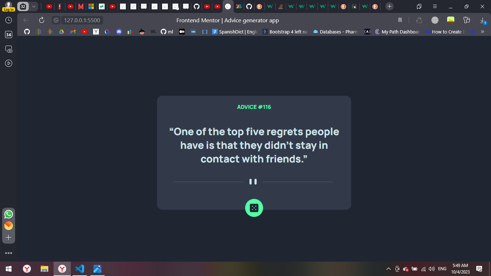

# Frontend Mentor - Advice generator app solution

This is a solution to the [Advice generator app challenge on Frontend Mentor](https://www.frontendmentor.io/challenges/advice-generator-app-QdUG-13db).

## Table of contents

- [Overview](#overview)
  - [The challenge](#the-challenge)
  - [Screenshot](#screenshot)
  - [Links](#links)
- [My process](#my-process)
  - [Built with](#built-with)
  - [What I learned](#what-i-learned)
  - [Continued development](#continued-development)
  - [Useful resources](#useful-resources)
- [Author](#author)
- [Acknowledgments](#acknowledgments)

## Overview

In this project I practice APIs and Json, and use html, css, js.

### The challenge

Users should be able to:

- Generate a new piece of advice by clicking the dice icon, using API where

### Screenshot



### Links

- Solution URL:
- Live Site URL:

## My process

### Built with

- Semantic HTML5 markup
- CSS custom properties
- JS
- API

### What I learned

In css I revised the concept of :root, and the usage of shadow boxes, and how to vertically center a div
in js i learned the usage of addEventListener

To see how you can add code snippets, see below:

```css
:root {
  --LightCyan: hsl(193, 38%, 86%);
  --NeonGreen: hsl(150, 100%, 66%);
  --GrayishBlue: hsl(217, 19%, 38%);
  --DarkGrayishBlue: hsl(217, 19%, 24%);
  --DarkBlue: hsl(218, 23%, 16%);
}
```

```css
div {
  margin: auto;
  position: relative;
  top: 50%;
  transform: translateY(50%);
}
```

```js
rollDice.addEventListener("click", setQuery);
```

### Continued development

As for future development, I would like to advance the speed of the project, and make the project pre-load an advice, and make better shadow box
**Note: Delete this note and the content within this section and replace with your own plans for continued development.**

<!-- ### Useful resources

- [Example resource 1](https://www.example.com) - This helped me for XYZ reason. I really liked this pattern and will use it going forward.
- [Example resource 2](https://www.example.com) - This is an amazing article which helped me finally understand XYZ. I'd recommend it to anyone still learning this concept.
 -->

## Author

Amira K.

<!-- - Website - [Add your name here](https://www.your-site.com)
- Frontend Mentor - [@yourusername](https://www.frontendmentor.io/profile/yourusername)
- Twitter - [@yourusername](https://www.twitter.com/yourusername)
 -->
